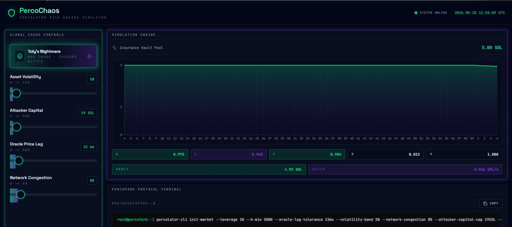

# ☢️ PercoChaos: Percolator Risk Engine Simulator

## OFFICIAL CONTRACT ADDRESS 🚀:
## DaRedy8D2BcDNHgpDyE2znsSVu6oMvoY8Efw9HqWpump

[](https://perco-chaos.vercel.app/)

A tactical, dark-mode "defense grid" UI built to stress-test and simulate Anatoly ("Toly") Yakovenko's Solana percolator perpetual-futures risk engine parameters under conditions of extreme market chaos.
Built natively as a local tactical defense grid dashboard to simulate the structural degradation of a decentralized insurance vault.




## ⚡ The Simulation Rules

This high-stakes dashboard simulates a perpetual risk engine handling potential structural insolvency.

---

## 🏎️ Core Features & Capabilities

* **Global Chaos Control Grid:** High-precision environmental sliders allowing developers and risk analysts to manipulate simulated network parameters in real time:
  * **Asset Volatility:** Scales from `0%` up to a hyper-volatile `150%`.
  * **Attacker Initial Capital:** Allocations scaling from `1 SOL` to a devastating `500 SOL`.
  * **Oracle Price Lag:** Simulates data transmission delays ranging from `0ms` to `500ms`.
  * **Dropped Slots / Network Congestion:** Injects packet drop parameters between `0%` and `90%`.
* **"Toly's Nightmare" Macro Trigger:** A nuclear diagnostic switch that instantly slams all environmental chaos parameters to their absolute mathematical limits simultaneously while firing off an instantaneous CSS-keyframe glitch/flash grid distortion overlay.
* **Continuous 60-Second Execution Loop:** A real-time reactive charting canvas tracking insurance pool health metrics down to minute decimals. The vault automatically rejuvenates upon loop completion—unless catastrophic failure occurs mid-cycle.
* **Persistent Crimson Red "DEFICIT" Override:** If environmental degradation forces the insurance vault balance to touch exactly `0.00 SOL`, the core UI flips states instantly into an Emergency Red `DEFICIT` system lock that locks down structural styling for the remaining duration of the active timeline cycle.
* **Ubuntu-Style Log Terminal Engine:** A low-profile streaming logger outputting dynamic system activity data strings and CLI bash parameters with localized instant clipboard-copy support.

---

## 🛠️ The Tech Stack

* **Framework:** Next.js (App Router workspace architecture)
* **Language:** TypeScript (Strictly typed code signatures)
* **Styling:** Tailwind CSS (Custom slate-950 layouts with glowing neon utility parameters)
* **Data Visualization:** Recharts (High-performance rendering for continuous data tracking arrays)
* **Iconography:** Lucide React

---

## 🚀 Local Installation & Deployment

Follow these quick commands to spin up the tactical defense grid locally on your machine:

1. **Clone and setup the repository:**
   ```bash
   git clone [https://github.com/zillaix/percochaos.git](https://github.com/zillaix/percochaos.git)
   cd percochaos
   npm install
   npm run dev

   Access the terminal control console:
Open your browser and point your URL navigation field to: http://localhost:3000

LIVE WEB : https://percochaos.com